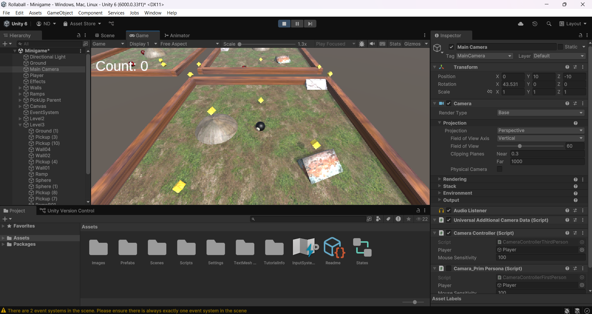
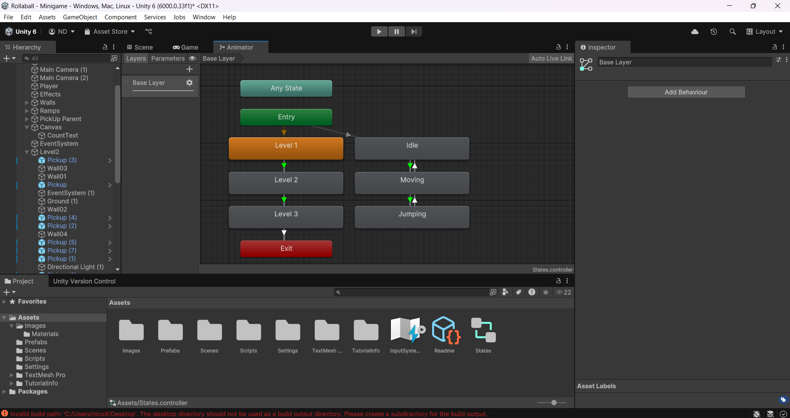

# Introdución
La plantilla "Roll a ball" consiste en el movimiento de una bola sobre un plano, el cual hemos modificado para que cuente con diferentes coleccionables, enemigos, y otras funcionalidades

La idea sobre mi enfoque artístico se basa en una mesa de billar, siendo nuestro personaje manejable una bola 8 que puede saltar entre diferentes escenarios mediante rampas y otras acciones

# Estructura del juego
La estructura básica del juego cuenta con 3 niveles diferentes que son similares entre sí, el primero siendo una especie de tutorial que no incluye enemigos de ningún tipo, saltando una rampa podremos encontrar otros niveles con número variable de enemigos para un avance lógico de la dificultad.

https://github.com/user-attachments/assets/9a38eadb-9ef8-47ea-aae4-f7eefdff8d1a

# Funcionalidades básicas
El proyecto cuenta con un sistema de movimiento para el protagonista, lo cual es bastante lógico teniendo en cuenta que es la base del videojuego, además de eso cuenta con 3 cámaras diferentes para poder elegir el sistema de juego que te sea más cómodo, aquí podemos ver la cámara en tercera persona:

y así se vería en tercera persona:

Además de esto encontramos un sistema de recogida de coleccionables y diferentes enemigos que nos hacen perder los coleccionables ya mencionados anteriormente al entrar en contacto con ellos.

# Sistema de texturas
El juego cuenta con texturas para darle un aspecto realista a los objetos que nos encontramos en nuestra aventura, desde los diferentes colecionables, hasta el protagonista o la mesa de billar

# Estados
El programa cuenta con funcionalidades relacionadas en estados, los cuales recogen los datos de cada nivel y los movimientos del protagonista

# Funcionamiento en android

